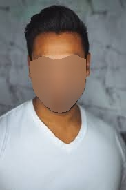

# Pixel-Precise Facial Blurring
Set up a video stream to blur out faces (and only faces) for any reason blurred facial bounding-boxes are not preferable. Set to revert to blurred bounding boxes automatically if the pixel-wise mask fails.

## 
 &nbsp; &nbsp;  

Depends on Openpose (https://github.com/CMU-Perceptual-Computing-Lab/openpose), Imagezmq, and opencv  
TODO: Update Readme...
